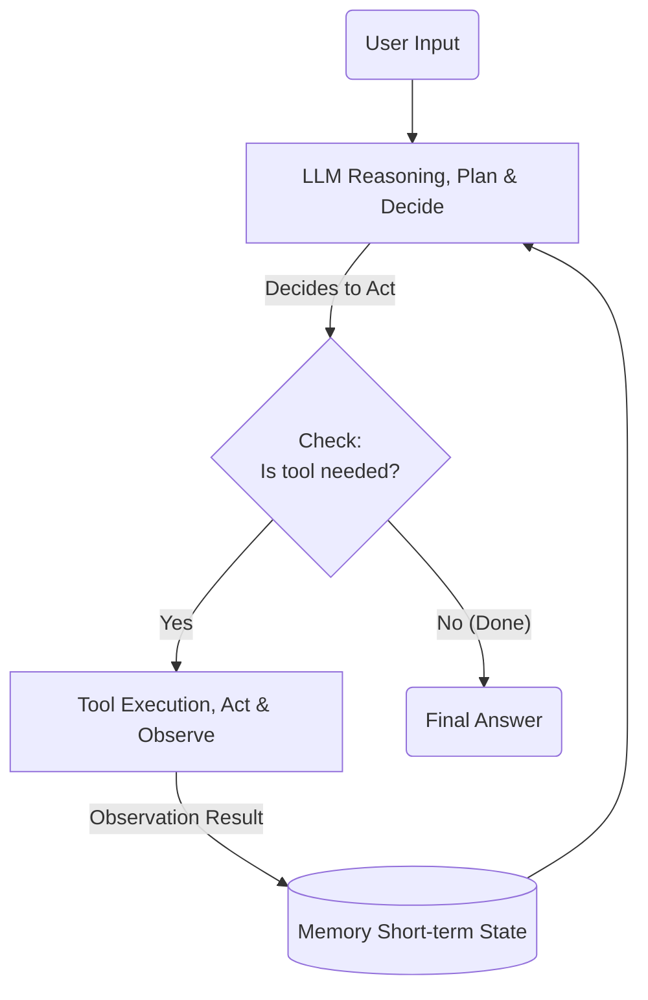

# LangchainResearchAgent
A research-assisting agent utilizing the langchain framework

```mermaid
graph TD
    User(User Input) --> NodeReasoning[LLM Reasoning, Plan & Decide]
    
    NodeReasoning -->|Decides to Act| Check{Check: <br/>Is tool needed?}
    
    Check -- Yes --> NodeTools[Tool Execution, Act & Observe]
    NodeTools -->|Observation Result| Memory[(Memory Short-term State)]
    
    Memory --> NodeReasoning
    
    Check -- No (Done) --> FinalResponse(Final Answer)
```